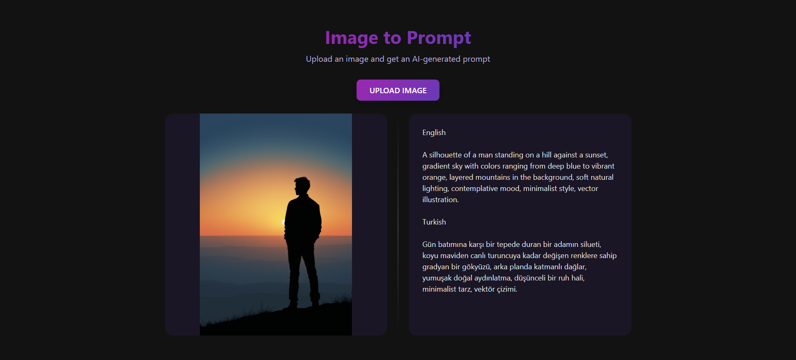

# Image-to-Prompt

A web application that converts images into detailed text prompts for text-to-image AI models.

## Live Demo

The project can be viewed live at: [https://ahmetalper-image-to-prompt.hf.space](https://ahmetalper-image-to-prompt.hf.space)

## Screenshots

## Features

- **Image Upload**: Support for PNG, JPG, JPEG, and WebP image formats
- **Bilingual Output**: Generates detailed prompts in both English and Turkish
- **AI-Powered**: Utilizes state-of-the-art vision-language model for high-quality prompt generation
- **User-Friendly Interface**: Simple web interface for easy image uploading and prompt retrieval
- **Optimized Descriptions**: Creates structured prompts specifically designed for text-to-image generation systems

## Technology Stack

- **Backend**: FastAPI (Python)
- **Frontend**: HTML, CSS, JavaScript
- **Server**: Uvicorn

## How It Works

1. Upload any supported image through the interface
2. The system analyzes the visual content using AI technology
3. A detailed, structured prompt is generated describing the image's content, style, and key elements
4. Results are presented in both English and Turkish
5. Use the generated prompts with your favorite text-to-image generation tools

## API Access

- **Endpoint**: `/api/v1/image-to-prompt`
- **Method**: POST
- **Content-Type**: multipart/form-data
- **Parameter**: `image` (file)
